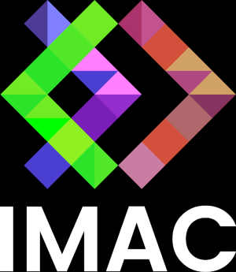
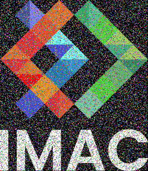
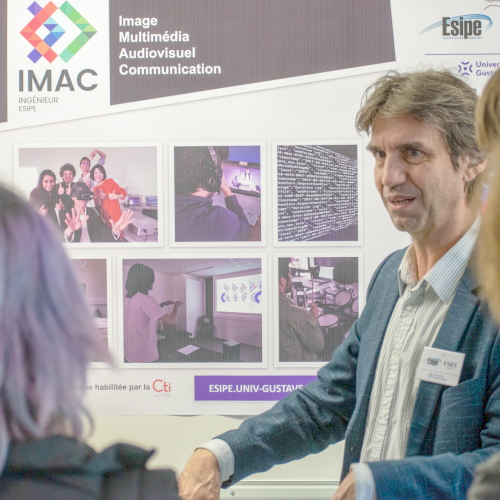
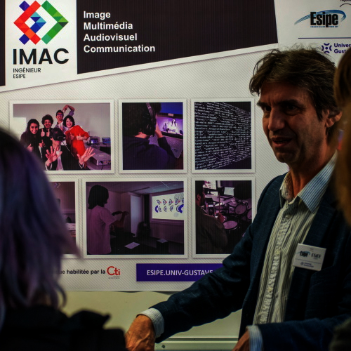
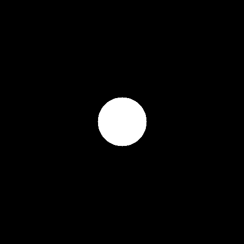
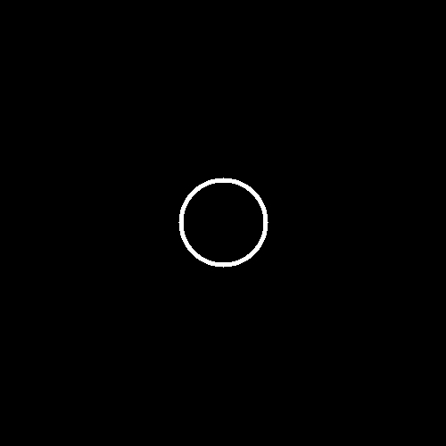
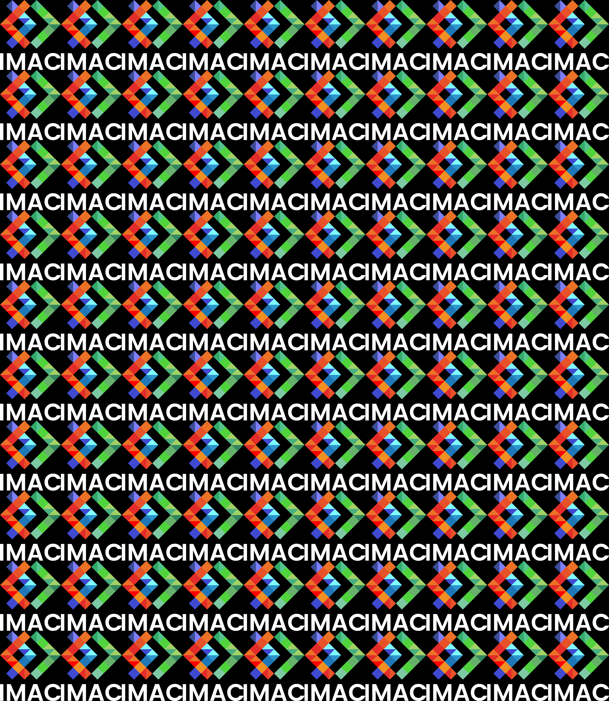
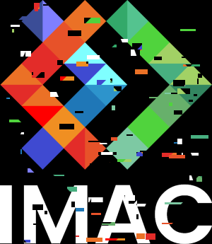

# 🐣 S1 | Prog: Workshop

## ⭐️ Ne garder que le vert
 

---

## ⭐️ Échanger les canaux
 

---

## ⭐️ Noir et blanc
 

---

## ⭐️ Négatif
 

---

## ⭐️ Dégradé

---

## ⭐️⭐️ Miroir
 

---

## ⭐️⭐️ Image bruitée
 

---

## ⭐️⭐️ Rotation de 90°
 

---

## ⭐️⭐️ RGB split
 

---

## ⭐️⭐️ Luminosité

---

## ⭐️⭐️(⭐️) Disque

---

## ⭐️ Cercle

---

## ⭐️⭐️⭐️ Rosace

---

## ⭐️⭐️ Mosaïque
 

---

## ⭐️⭐️⭐️⭐️ Mosaïque miroir
 

---

## ⭐️⭐️⭐️ Glitch
 